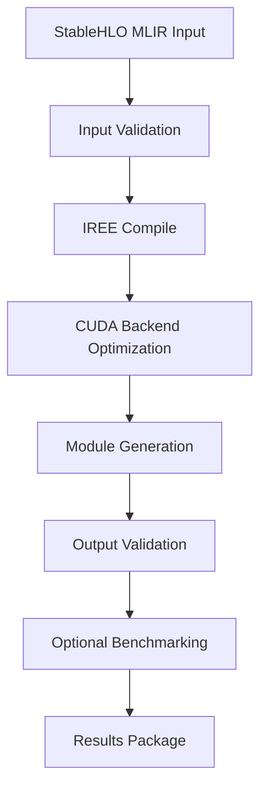

# Standalone IREE Compiler Docker Architecture

## Overview

This design outlines a standalone Docker-based IREE compilation service that takes StableHLO MLIR as input and produces optimized backend-specific executables. The architecture is decoupled from skainet to provide a reusable compilation service.

## Architecture Components

### 1. Docker Image Structure

```
iree-compiler:cuda-latest
├── IREE Toolchain
│   ├── iree-compile (main compiler)
│   ├── iree-run-module (runtime executor)
│   └── iree-benchmark-module (performance testing)
├── CUDA Runtime
│   ├── CUDA Toolkit 12.x
│   ├── cuDNN libraries
│   └── NVIDIA drivers (runtime)
├── Compilation Scripts
│   ├── compile.sh (main entry point)
│   ├── validate.sh (output validation)
│   └── benchmark.sh (performance testing)
└── Input/Output Volumes
    ├── /input (StableHLO MLIR files)
    ├── /output (compiled modules)
    └── /config (compilation parameters)
```

### 2. Service Interface

#### Input Format
```json
{
  "input_file": "/input/model.mlir",
  "target": "cuda",
  "optimization_level": "O3",
  "target_features": ["sm_80", "sm_86"],
  "output_format": "vmfb",
  "validation": true,
  "benchmark": false
}
```

#### Output Format
```json
{
  "status": "success",
  "output_file": "/output/model.vmfb",
  "compilation_time": "2.3s",
  "module_size": "1.2MB",
  "validation_result": "passed",
  "benchmark_results": {
    "latency_ms": 15.2,
    "throughput_ops_per_sec": 1250
  },
  "metadata": {
    "iree_version": "20241220.123",
    "cuda_version": "12.3",
    "target_arch": "sm_80"
  }
}
```

### 3. Compilation Pipeline



### 4. Docker Container Variants

#### Primary Image: CUDA Focus
- **iree-compiler:cuda-12.3**: Full CUDA 12.3 support with all SM architectures
- **iree-compiler:cuda-slim**: Minimal CUDA runtime for specific architectures
- **iree-compiler:cuda-dev**: Development version with debugging tools

#### Future Extensions
- **iree-compiler:cpu**: CPU-optimized compilation
- **iree-compiler:vulkan**: Vulkan GPU support
- **iree-compiler:multi**: Multi-backend support

## Implementation Strategy

### Phase 1: CUDA-First Implementation

1. **Base Docker Image**
   ```dockerfile
   FROM nvidia/cuda:12.3-devel-ubuntu22.04
   
   # Install IREE from source or prebuilt binaries
   RUN apt-get update && apt-get install -y \
       python3 python3-pip cmake ninja-build \
       && pip3 install iree-compiler iree-runtime
   
   # Copy compilation scripts
   COPY scripts/ /usr/local/bin/
   
   # Set up volumes and entry point
   VOLUME ["/input", "/output", "/config"]
   ENTRYPOINT ["/usr/local/bin/compile.sh"]
   ```

2. **Compilation Script**
   ```bash
   #!/bin/bash
   # compile.sh - Main compilation entry point
   
   CONFIG_FILE="/config/compile_config.json"
   INPUT_FILE=$(jq -r '.input_file' $CONFIG_FILE)
   TARGET=$(jq -r '.target' $CONFIG_FILE)
   
   iree-compile \
     --iree-hal-target-backends=$TARGET \
     --iree-hal-cuda-llvm-target-arch=sm_80 \
     $INPUT_FILE \
     -o /output/compiled_module.vmfb
   ```

3. **Usage Interface**
   ```bash
   # Simple compilation
   docker run --gpus all \
     -v $(pwd)/input:/input \
     -v $(pwd)/output:/output \
     -v $(pwd)/config:/config \
     iree-compiler:cuda-latest
   
   # With custom configuration
   echo '{"input_file":"/input/model.mlir","target":"cuda"}' > config.json
   docker run --gpus all \
     -v $(pwd)/model.mlir:/input/model.mlir \
     -v $(pwd)/output:/output \
     -v $(pwd)/config.json:/config/compile_config.json \
     iree-compiler:cuda-latest
   ```

### Phase 2: Service Orchestration

1. **REST API Wrapper** (Optional)
   - HTTP endpoint for remote compilation
   - Job queue for batch processing
   - Status monitoring and logging

2. **CLI Tool**
   ```bash
   # Standalone CLI that manages Docker containers
   iree-docker-compile \
     --input model.mlir \
     --target cuda \
     --output model.vmfb \
     --arch sm_80
   ```

## Key Benefits of This Architecture

1. **Complete Separation**: No dependency on skainet codebase
2. **Reusable Service**: Can be used by any system that generates StableHLO
3. **Hardware Optimization**: CUDA-first approach with specific GPU targeting
4. **Scalable**: Easy to add new backends (CPU, Vulkan, Metal)
5. **Containerized**: Consistent compilation environment across platforms
6. **Validation Built-in**: Automatic output validation and benchmarking

## Integration Points

### With Existing Systems
- Any system generating StableHLO MLIR can use this service
- Simple file-based or API-based integration
- No code dependencies, just Docker runtime requirement

### Future skainet Integration
- skainet can call this service via Docker API
- Maintains clean separation of concerns
- Easy to version and update independently

## Next Steps

1. Create base CUDA Docker image with IREE toolchain
2. Implement compilation scripts with CUDA optimization
3. Add validation and benchmarking capabilities
4. Create simple CLI wrapper for ease of use
5. Test with various StableHLO MLIR inputs
6. Document usage patterns and best practices

This architecture provides a clean, standalone solution that focuses on CUDA compilation while remaining extensible for future backend support.